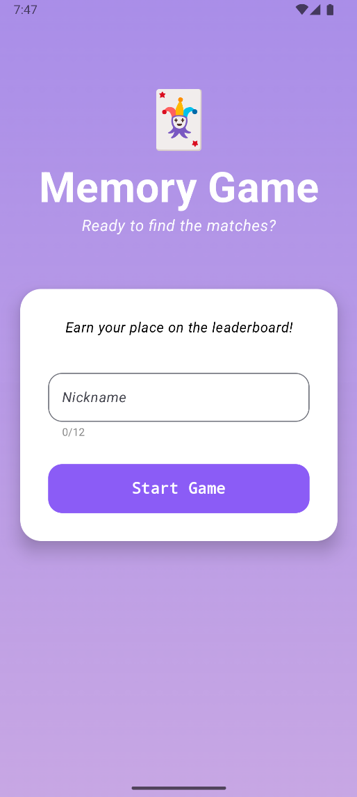
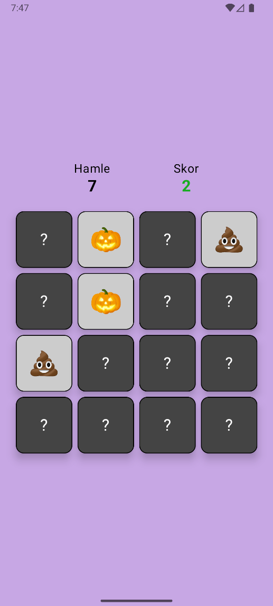
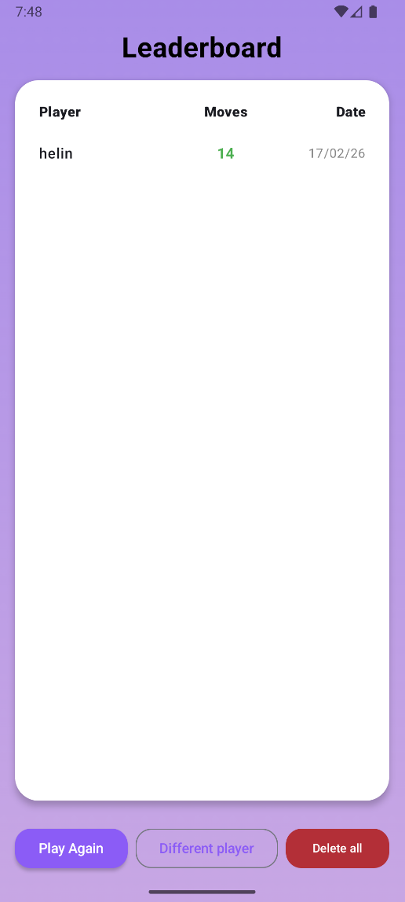

<div align="center">

# 🃏 Memory Game

### A beautifully crafted Android card-matching game built with Jetpack Compose

[](https://kotlinlang.org)
[](https://developer.android.com)
[](https://developer.android.com/jetpack/compose)
[](https://dagger.dev/hilt/)
[](https://github.com/features/actions)
[](LICENSE)

<br/>

*Flip the cards. Find the matches. Claim your spot on the leaderboard.*

</div>

---

## 📖 Table of Contents

[About](#-about) • [Features](#-features) • [Screenshots](#-screenshots) • [Tech Stack](#-tech-stack) • [Architecture](#-architecture) • [Project Structure](#-project-structure) • [Getting Started](#-getting-started) • [CI/CD Pipeline](#-cicd-pipeline) • [How to Play](#-how-to-play) • [Contributing](#-contributing)

---

## 🎯 About

**Memory Game** is a classic card-matching game for Android, designed with modern Android development best practices in mind. Players flip cards to find matching emoji pairs, tracking both the number of moves and successful matches. At the end of each game, your score is saved to a local leaderboard so you can compete against yourself — or others!

This project was built as a hands-on exercise in **clean architecture**, **Jetpack Compose UI**, **dependency injection with Hilt**, and **local data persistence** using both Room and DataStore.

---

## ✨ Features

| Feature | Description |
|---|---|
| 🎮 **Classic Gameplay** | 16-card grid (8 pairs) with smooth flip mechanics |
| 👤 **Player Nicknames** | Personalized experience saved across sessions via DataStore |
| 🏆 **Persistent Leaderboard** | Scores stored locally with Room database, ranked by score & efficiency |
| 🎨 **Modern UI** | Fully built with Jetpack Compose and Material 3 |
| 🔄 **Seamless Navigation** | Type-safe navigation with Compose Navigation |
| 💉 **Dependency Injection** | Clean, testable code powered by Hilt |
| ⚡ **CI/CD Pipeline** | Automated build validation on every push with GitHub Actions |
| 🗑️ **Score Management** | Clear all scores with a single tap |

---

## 📱 Screenshots

<div align="center">

| Onboarding | Game Board | Leaderboard |
|:---:|:---:|:---:|
|  |  |  |
| Enter your nickname | Match the emoji pairs | See all-time scores |

</div>

---

## 🛠 Tech Stack

| Layer | Technology | Purpose |
|---|---|---|
| **🎨 UI** | Jetpack Compose | Declarative UI toolkit |
| **🎨 UI** | Material 3 | Design system & components |
| **🎨 UI** | Compose Navigation | Type-safe screen navigation |
| **🧠 Logic** | ViewModel | UI state management |
| **🧠 Logic** | Kotlin Coroutines | Asynchronous operations |
| **🧠 Logic** | Kotlin Flow | Reactive data streams |
| **💾 Data** | Room Database | Local score persistence |
| **💾 Data** | DataStore Preferences | Nickname storage |
| **💾 Data** | Repository Pattern | Clean data abstraction |
| **🔧 DI** | Hilt | Dependency injection |
| **⚡ CI/CD** | GitHub Actions | Automated build & test pipeline |
| **🧪 Testing** | JUnit 4 | Unit testing framework |
| **🧪 Testing** | MockK | Mocking library for Kotlin |
| **🧪 Testing** | Coroutines Test | Testing asynchronous code |

---

## 🏗 Architecture

This project follows **Clean Architecture** principles with a clear separation between layers.

> [!IMPORTANT]
> By placing the `ScoreRepository` interface in the **Domain** layer and its implementation in the **Data** layer, the project adheres to the **Dependency Inversion Principle**, making the business logic completely independent of the database implementation.

```
┌─────────────────────────────────────────────────────────────────┐
│                        PRESENTATION LAYER                       │
│   ┌──────────────┐   ┌──────────────┐   ┌──────────────────┐   │
│   │  Onboarding  │   │    Game      │   │     Score        │   │
│   │  Screen +    │   │  Screen +    │   │   Screen +       │   │
│   │  ViewModel   │   │  ViewModel   │   │   ViewModel      │   │
│   └──────┬───────┘   └──────┬───────┘   └───────┬──────────┘   │
│          └──────────────────┼──────────────────-─┘              │
│                             │ Navigation                         │
└─────────────────────────────┼───────────────────────────────────┘
                              │
┌─────────────────────────────▼───────────────────────────────────┐
│                         DOMAIN LAYER                             │
│            ScoreRepository (Interface)  |  UserScore (Model)    │
└─────────────────────────────┬───────────────────────────────────┘
                              │
┌─────────────────────────────▼───────────────────────────────────┐
│                          DATA LAYER                              │
│   ┌────────────────────┐        ┌─────────────────────────┐    │
│   │  Room Database     │        │  DataStore Preferences   │    │
│   │  (ScoreDao,        │        │  (UserPreferences /       │    │
│   │   AppDatabase)     │        │   Nickname storage)       │    │
│   └────────────────────┘        └─────────────────────────┘    │
│             ScoreRepositoryImpl (concrete implementation)        │
└─────────────────────────────────────────────────────────────────┘
```

### Key Design Decisions

- **Repository Pattern** — The `ScoreRepository` interface in the domain layer keeps the presentation layer completely decoupled from data sources.
- **Unit Testing with MockK** — Critical business logic, like nickname validation and score calculations, is verified with automated unit tests to ensure reliability.
- **Single Source of Truth** — Game state lives entirely in `GameViewModel`, preventing UI inconsistencies.
- **StateFlow over LiveData** — Embracing modern reactive Kotlin idioms for lifecycle-aware state collection.
- **Type-Safe Navigation** — Using `@Serializable` route objects instead of string-based routes to eliminate runtime navigation errors.

---

## 📁 Project Structure

```
com.example.memorygame
│
├── 📂 data
│   ├── local
│   │   ├── AppDatabase.kt         # Room database setup
│   │   ├── ScoreDao.kt            # Database queries
│   │   └── UserPreferences.kt     # DataStore wrapper
│   └── repository
│       └── ScoreRepositoryImpl.kt # Repository implementation
│
├── 📂 di
│   └── AppModule.kt               # Hilt dependency providers
│
├── 📂 domain
│   ├── model
│   │   └── UserScore.kt           # Core data model / Room entity
│   └── repository
│       └── ScoreRepository.kt     # Repository interface (contract)
│
├── 📂 presentation
│   ├── game
│   │   ├── GameViewModel.kt       # Game state & logic
│   │   ├── GameScreen.kt          # Game UI
│   │   └── components
│   │       ├── CardGrid.kt        # Card grid layout
│   │       ├── MyCard.kt          # Individual card composable
│   │       └── ScoreBoard.kt      # Moves & score display
│   ├── onboarding
│   │   ├── OnboardingViewModel.kt
│   │   ├── OnboardingScreen.kt
│   │   └── components
│   │       ├── OnboardingHeader.kt
│   │       └── NicknameInputCard.kt
│   ├── score
│   │   ├── ScoreViewModel.kt
│   │   ├── ScoreScreen.kt
│   │   └── components
│   │       └── ScoreRow.kt
│   └── navigation
│       ├── Navigation.kt          # NavHost setup
│       ├── Screen.kt              # Route definitions
│       └── StartViewModel.kt      # Determines start destination
│
├── MainActivity.kt
└── MemoryGameApplication.kt       # Hilt entry point
```

---

## 🚀 Getting Started

### Prerequisites

- Android Studio **Hedgehog** or newer
- JDK **17**
- Android SDK **API 24+** (minSdk)
- Gradle **8.x**

### Installation

```bash
# 1. Clone the repository
git clone https://github.com/helinertgrl/memory-game.git

# 2. Open in Android Studio
# File → Open → Select the cloned folder

# 3. Let Gradle sync complete

# 4. Run on emulator or physical device
# Run → Run 'app'  (Shift + F10)
```

### Build Variants

| Variant | Description |
|---|---|
| `debug` | Development build with logging |
| `release` | Optimized build for production |

---

## ⚙️ CI/CD Pipeline

This project uses **GitHub Actions** for continuous integration. Every push and pull request to `master` triggers an automated workflow to maintain code quality and prevent regressions.

```yaml
Steps:
  ✅ Checkout code
  ✅ Set up JDK 17
  ✅ Grant execute permissions to Gradlew
  ✅ Build validation (assembleDebug)
  ✅ Run Automated Unit Tests (testDebugUnitTest) 🚀
```

The green badge in commit history confirms that the code is both buildable and logically sound before any manual review. 🟢

---

## 🎮 How to Play

```
1.  Launch the app
          │
          ▼
2.  Enter your nickname  ──→  saved for future sessions
          │
          ▼
3.  The 4×4 card grid appears (all cards face-down)
          │
          ▼
4.  Tap a card to flip it
          │
          ▼
5.  Tap a second card
         / \
        /   \
  Match!     No match
    │              │
    ▼              ▼
Cards stay    Cards flip back
face-up       after 0.8s
    │
    ▼
6.  Match all 8 pairs to win!
          │
          ▼
7.  Score is saved → Leaderboard screen
```

### 🏆 Scoring System

| Metric | Details |
|---|---|
| **Moves** | Total number of card flip attempts (lower is better) |
| **Score** | Number of matched pairs found (max 8) |
| **Ranking** | Sorted by highest score first, then fewest moves |
| **Date** | Each entry timestamped automatically |

---

## 🤝 Contributing

Contributions, issues, and feature requests are welcome!

1. Fork the repository
2. Create your feature branch: `git checkout -b feature/amazing-feature`
3. Commit your changes: `git commit -m 'feat: add amazing feature'`
4. Push to the branch: `git push origin feature/amazing-feature`
5. Open a Pull Request

---

<div align="center">

Made with ❤️ and Kotlin

⭐ **Star this repo if you found it useful!** ⭐

</div>
